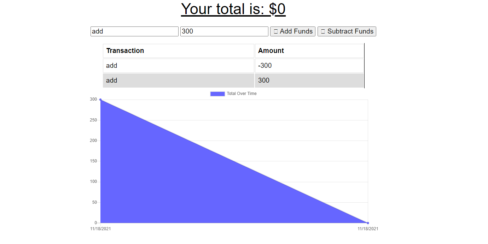

# Budget-tracker

## Table of contents
​
- [General info](#General-Info)
- [Technologies](#Technologies)
- [Deployment](#Deployment)

## General-Info
​
This apllication allows the simple tracking of budget information that saved into a MongoDB database and can be installed as a progressive web application. 

​
Landing page 
​

​
## Technologies
​
Project is created with:
​
- [JavaScript](https://www.javascript.com/)
- [Bootstrap](https://getbootstrap.com/)
- [Node.js](https://nodejs.org/)
- [Express.js](https://expressjs.com/)
- [MongoDb](https://www.mongodb.com/)
- [Mongoose](https://mongoosejs.com/)

## Deployment
​
Download the repository
​
- Copy the repo
- Install dependencies
- Run locally with node server.js in root folder or deploy with a linked MongoDB server
- You can also follow the deployed link below: 
- https://gentle-shelf-43428.herokuapp.com/
​
​
​
## Routing-Explained
​
This project uses Heroku with a linked MongoDB.
​
## Authors
​
- Gavin Murphy
​
## License
​
- Open Source